# Assignment 1
+ 2023-11-13
+ Honggang Chen, CID: chenhon 
---
### 2 Points in Homogeneours  Coordinates
####  Theoratical exercise 1
+ (1)
```math
x1=
\begin{pmatrix}
2 \\
-8
\end{pmatrix}
\;\;

x2=
\begin{pmatrix}
3 \\
-7
\end{pmatrix}
\;\;


x3=
\begin{pmatrix}
1.5 \\
-0.5
\end{pmatrix}
\;\;

```

+ (2)
it means $x_4$ is an infinitely distant point.

+ (3)
$x_5$ is not the same point as $x_4$, but it is also an infinitely distant point.

####  Computer exercise 1
+ pflat (mfile is:pflat.m)
```matlab
function [x_output] = pflat(x_input)
%UNTITLED Summary of this function goes here
%   Detailed explanation goes here
x_n = x_input(end,:);
x_output = x_input./x_n;
end
```
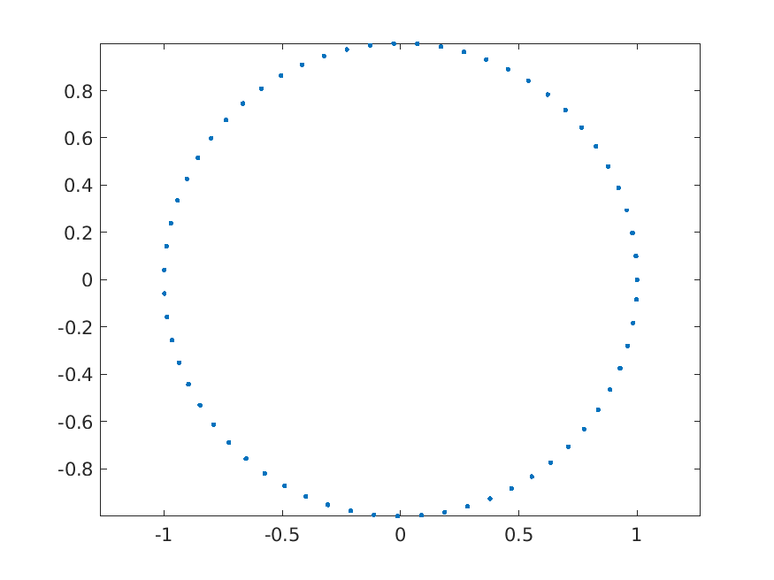
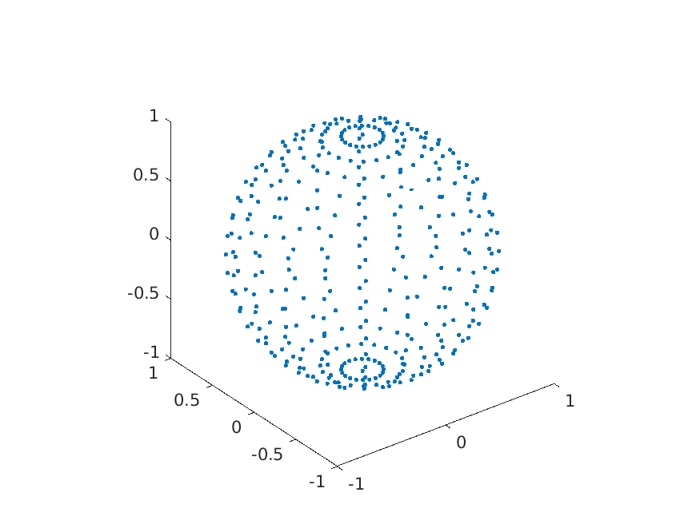

---
### 3 Lines
####  Theoratical exercise 2
+ (1)
  We can get the intersection point by calculating the cross production of two lines.

  ```math 
  cross(l_1^T, l_2^T) = 
  \begin{vmatrix}
  i  & j & k \\
  -1 & 1 & 1 \\
  6  & 3 & 1 
  \end{vmatrix} \\
  \begin{align}
    &= (1*1-1*3)*i + (1*6-(-1)*1)*j + ((-1)*3-1*6)*k  \;\;\;\;\;\\
    &= (-2)i + 7j + (-9)k
  \end{align}
  ```

  Thus, homogeneous poit of interstion is $(-2,7,-9)^T$, or equivalently, $(\frac{2}{9},\frac{7}{9},1)^T$, by dividing out the third coordinate. And the corresponding point int $\R^2$ is $(\frac{2}{9},\frac{7}{9})^T$.

+ (2) 
  Same as (1), we the corss production of tow lines is: $0i+(-17)j+0k$, thus the interstion point is $(0,-17,0)$, a point at infinte distance in $R^2$. It meant the two lines do not intersect at a finite point on the Euclidean plane.

+ (3)
  Let $l=(a,b,c)^T$ denotes the line passing through point $x_1$ and $x_2$ (in homogeneous coordination). Then $x_1$ and $x_2$ must lie on the line. Thus, $x_1^Tl=0$ and $x_2^Tl=0$. The vector represnted by $l$ must be orthogonal to both $x_1$ and $x_2$. And such a vector is the cross production of the vectors represented by $x_1$ and $x_2$. So, the line is:

  ```math
  x_1 \times x_2 = (-1,1,1)^T \times (6,3,1)^T = (-2)i+7j+(-9)k
  ```

  Thus, the homogeneous representation of $l$ is $(-2,7,-9)^T$, or equivalently,  $(\frac{2}{9},\frac{7}{9},1)^T$, by dividing out the third coordinate. 
  <!-- https://cseweb.ucsd.edu/classes/sp06/cse152/hw1sol.pdf -->

---
####  Theoratical exercise 3
+ (1)
  Lex $x$ denotes the intersection point, and $l_1,l_2$ denote the homogeneous representations of the two lines. Tthe intersection point of two line must lie on both line (obviously). Thus, $l_1^Tx=0,l_2^Tx=0$, then $x$ must be orthogonal to both lines. Such vector, represented by the point $x$, should be the cross production. So there will be only one result in $P^2$, just the intersection point. 


####  Computer exercise 2
+ Plotted figure for (1)(2)(3)
  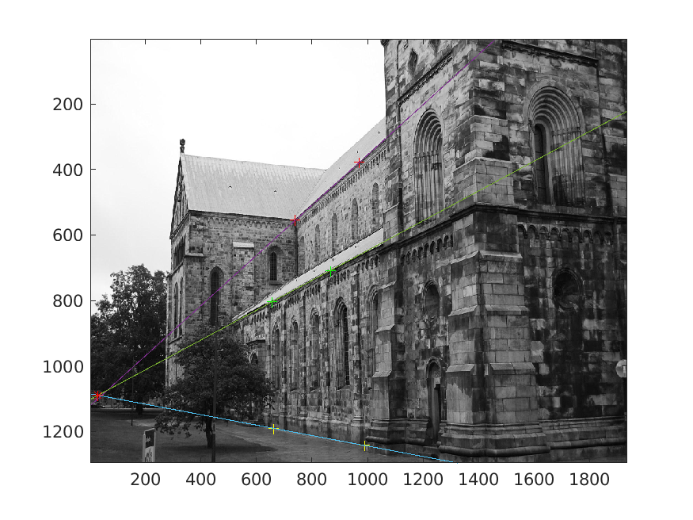

+ for (2)
  These lines appear to beparallel in 3D. 

+ for (4), the code of (point_line_distance_2D.m) is below, and the intersection point is the red start in image above:
  ```matlab
  function [dist] = point_line_distance_2D(p,line)
  %POINT_LINE_DISTANCE_2D Summary of this function goes here
  %   Detailed explanation goes here
  a=line(1);
  b=line(2);
  c=line(3);
  x1=p(1);
  x2=p(2);

  dist =abs(a*x1+b*x2+c)/sqrt(a*a+b*b);
  end
  ```
+ For (5), the distance between $l_1$ and the interescetion point is 8.2695, not close to 0 in purely numerical terms. It is because the size of the image is up to (1300,1900). After being normalized, the distance is quite small. So three lines can be considered as intersecting at a single point.


---
### 4 Projective Transformations
####  Theoratical exercise 4

+ (1) 
  ```math
  y_1= \begin{pmatrix} 1 & 1 & 1\end{pmatrix}^T \\
  y_2= \begin{pmatrix} 1 & 2 & 0\end{pmatrix}^T \\

  ```
+ (2)
  ```math
  l_1=\begin{pmatrix} -1 & -1 & 1\end{pmatrix}^T \\
  l_2=\begin{pmatrix} -2 & 1 & 1\end{pmatrix}^T \\
  ```
+ (3)
  ```math
    (H^{-1})^Tl_1 = \begin{pmatrix} -1 & 0.5 & 0.5 \end{pmatrix}^T = 
    \begin{pmatrix} -2 & 1 & 1\end{pmatrix}^T = l_2 
  ```

####  Theoratical exercise 5
+ (1)
  ```math
   0 = l_1^Tx = l_1^TIx=l_1^TH^{-1}Hx = ((H^{-T}l_1)^T)(Hx) = l_2^Ty
  ```
  After transformation, $y=Hx$ lie on $l_2$ when $l_2=H^{-T}l_1$.

####  Theoratical exercise 6
+ (a) $H_1$ $H_2$ $H_3$  $H_4$
+ (b) $H_1$ $H_2$ $H_3$  $H_4$
+ (c) $H_2$
+ (d) $H_2$
+ (e) $H_2$
+ (f) $H_1$ $H_2$ $H_3$  $H_4$
+ (g) $H_1$ $H_2$

---
### 5 The Pinhole Camera
####  Theoratical exercise 7
  + (1)
    ```math 
      X_1^{*} = \begin{pmatrix} 1 & 2 & 0 \end{pmatrix}^T \\
      X_2^{*} = \begin{pmatrix} 1 & 1 & 2 \end{pmatrix}^T \\
      X_3^{*} = \begin{pmatrix} 2 & 1 & -2 \end{pmatrix}^T
    ```
    the projection of $X_1$ means : point $X_1 will not lies on the camera plane. 
  + (2)
    The center of camera is:
    ```math
    C = \begin{pmatrix} 0 & 0 & 1 \end{pmatrix}^T
    ```
    The principle axis is looking into z, with dircetion: 
    ```math
      \begin{pmatrix} 0 & 0 & 1 \end{pmatrix}^T
    ```

####  Computer exercise 3
+ the camera center:
    The center of camera and principle axis of P1:
    ```math
    C_{p1} = \begin{pmatrix} 0 & 0 & 0 \end{pmatrix}^T \\
    Axis_{P1}=\begin{pmatrix} 0.3129 & 0.9461 & 0.0837 \end{pmatrix}^T
    ```
  The center of camera and principle axis of P2:
    ```math
    C_{p2} = \begin{pmatrix} 6.6352 & 14.8460 & -15.0691 \end{pmatrix}^T \\
    Axis_{P2}=\begin{pmatrix} 0.0319 & 0.3402 & 0.9398 \end{pmatrix}^T
    ```

+ camera P1 and P2 in 3D (images from different angle)
  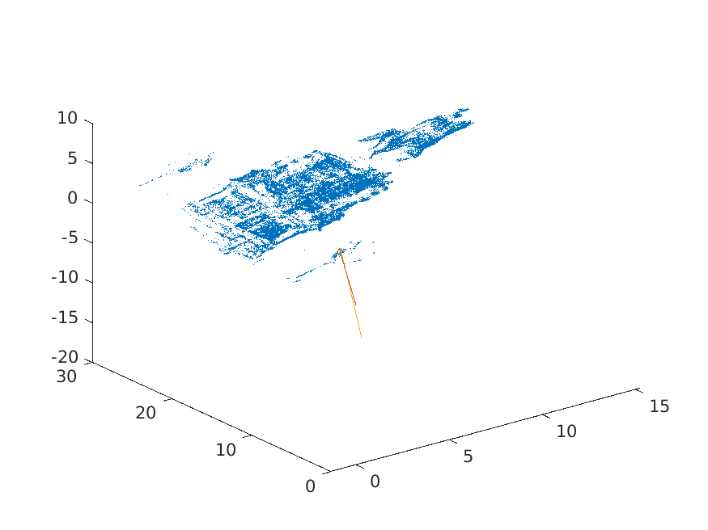
  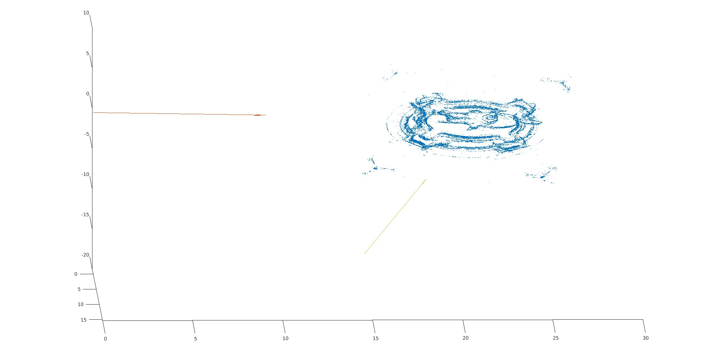

+ code (camera_center_and_axis.m):
  ```matlab
    function [center,principal_axis] = camera_center_and_axis(camera_p)
    %UNTITLED Summary of this function goes here
    %   Detailed explanation goes here
    P33=camera_p(1:3,1:3);
    P4 = camera_p(:,4);
    center = -inv(P33)*P4;
    principal_axis = transpose(P33)*[0;0;1];
    principal_axis = principal_axis/ norm(principal_axis);
    end
  ```

+ code (plot_camera.m):
  ```matlab
    function plot_camera(camera_p, scale)
    %PLOT_CAMERA Summary of this function goes here
    %   Detailed explanation goes here
    [center axis] = camera_center_and_axis(camera_p);
    quiver3(center(1),center(2),center(3),axis(1),axis(2),axis(3), scale);
    end
  ```
+ Project U into P1:
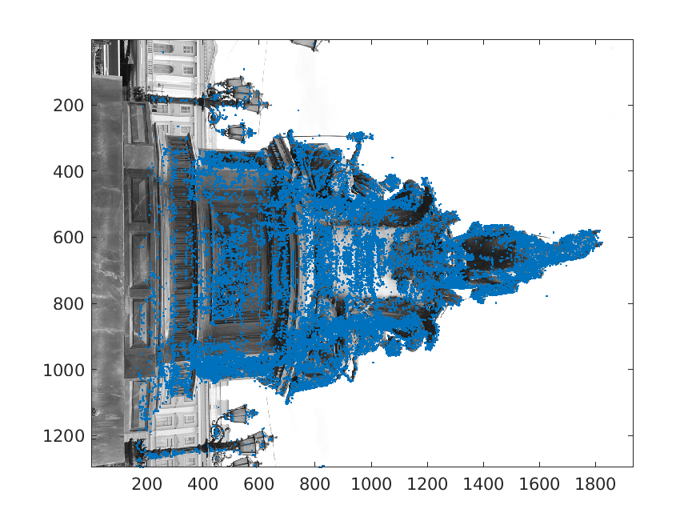

+ Project U into P2:
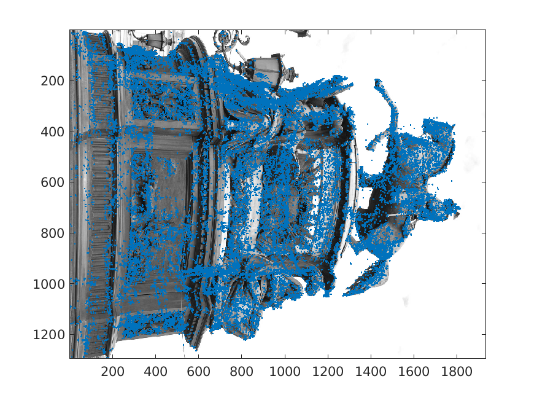

---
### Optional
####  Theoratical exercise 8
+ (1)

We can get the following equal of P1 and x:
  ```math
  x=P_{1}U =  [\begin{matrix} I & 0 \end{matrix}]U = IU_{1,3} + 0U_{4} 
  ```
Then:
  ```math
  U(s) = \begin{pmatrix} x^T , S \end{pmatrix}^T = \begin{pmatrix} U_{1,3}^T,S \end{pmatrix}^T
  ```
Because x is the projection of U in P1, and:
  ```math
  U(s) = \begin{pmatrix} x^T , s \end{pmatrix}^T = \begin{pmatrix} U_{1,3}^T,s \end{pmatrix}^T
  ```
So:
  ```math
  \begin{pmatrix} x \\ s \end{pmatrix} \sim \begin{pmatrix} U_{1,3} \\ s \end{pmatrix} = U
  ```
The collection of points is the line in $P^3$.

+ (2)

We have:
  ```math
  {\Pi}^TU(s)=0 = \begin{pmatrix} \pi \\ 1 \end{pmatrix}^T\begin{pmatrix} x \\ s \end{pmatrix} = {\pi}^Tx+s
  ```
So:
  ```math
  s = -{\pi}^Tx
  ```

+ (3)

We have:
  ```math
  x \sim P_1U  = U_{1,3}
  ```
  ```math
  y \sim P_2U  = [\begin{matrix} R & t \end{matrix}]U = RU_{1,3} + tU_4 = RU_{1,3} + ts 
  ```
Using s we get from (2), then:
  ```math
  y \sim  RU_{1,3} + ts = Rx -t{\pi}^Tx = (R-t{\pi}^T)x
  ```

####  Computer exercise 4
+ (1)

corner points and the image in the same 2D-figure. 
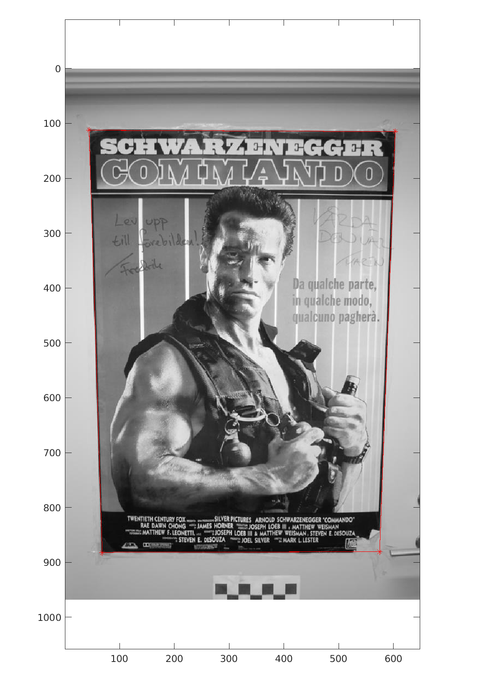
The origin of the image coordinate system located at the top-left corner.

+ (2)

corner points without K
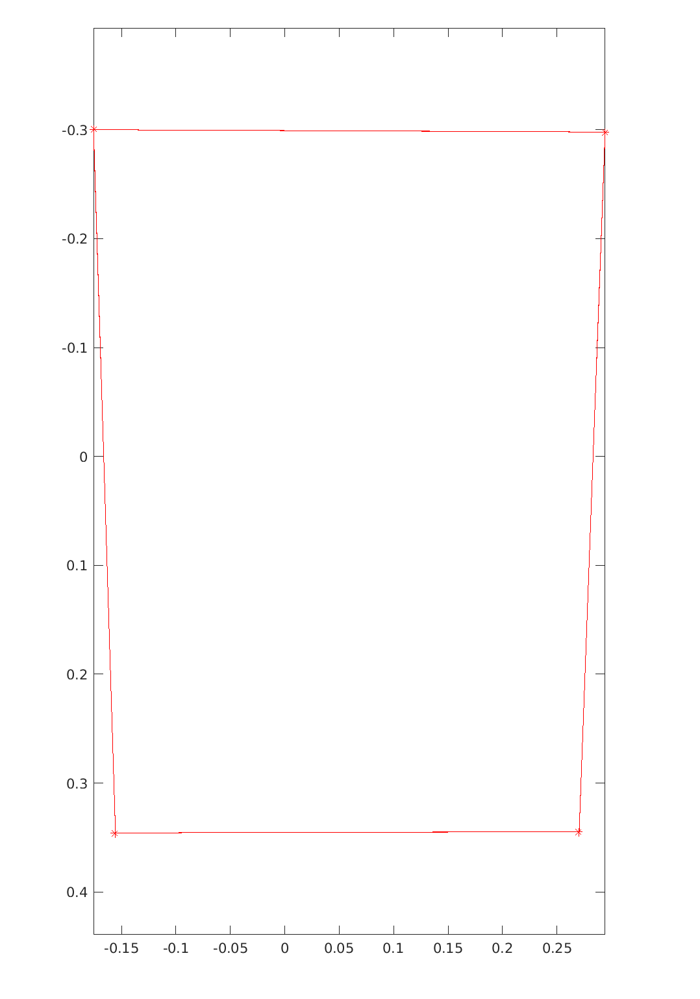
The origin of the coordinate system located at the center of four points.

+ (3)(4)

the camera center and principal axis of P1:
  ```math
  C_{p1} = \begin{pmatrix} 0 & 0 & 0 \end{pmatrix}^T \\
  Axis_{p1} = \begin{pmatrix} 0 & 0 & 1 \end{pmatrix}^T
  ```
the camera center and principal axis of P2:
  ```math
  C_{p2} = \begin{pmatrix} -2 & 0 & 0 \end{pmatrix}^T \\
  Axis_{p2} = \begin{pmatrix} 0.5 & 0 & 0.8660 \end{pmatrix}^T
  ```

camera P1 and P2 with 3D points of corners in plane v:
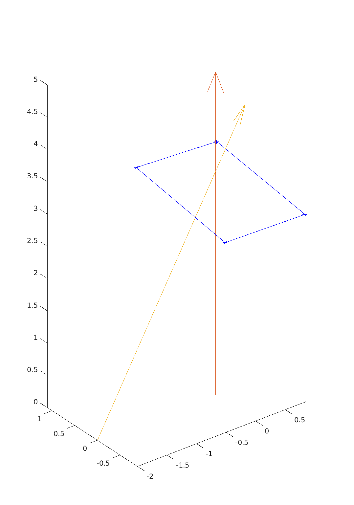

+ (5)

transform the corner points (P1->P2, 3D->P2). This give the same result.
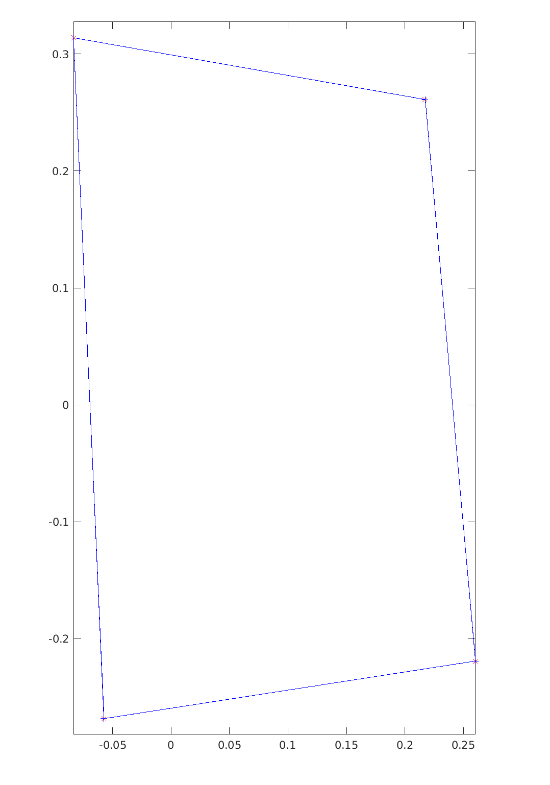

+ (6)
transform the image and corner points into P2
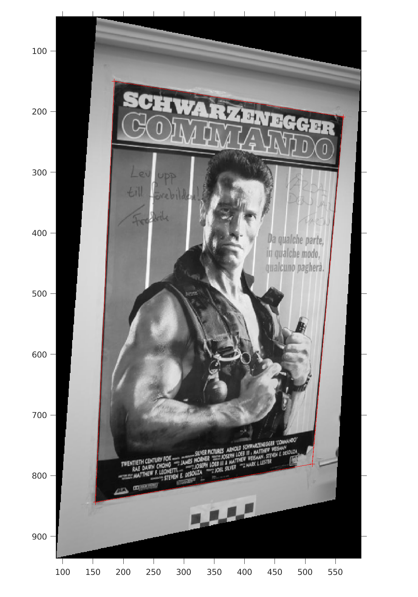

+ (7) code (run4.m)
```matlab
% clean history and terminal
clear
clc
% 

addpath './code'

load("data/compEx4.mat");

% load image
img = imread("data/compEx4.jpg");
imagesc(img);
colormap gray
axis equal 

K_inv = inv(K)
n_corners = K_inv* corners

hold on 
% plot corners
plot(corners(1,[1:end 1]),corners(2,[1:end 1]),'*-', 'Color','r');
saveas(gcf,"corners_with_image.png");
hold off 
% plot corners without K
plot(n_corners(1,[1:end 1]),n_corners(2,[1:end 1]),'*-', 'Color','r');
axis ij
axis equal
saveas(gcf,"corners_without_k.png");

% show 3d point and camera center
pv = pflat(v)
s = -pv(1:3)'*n_corners
u = pflat([n_corners;s])

plot3(u(1,[1:end 1]),u(2,[1:end 1]),u(3,[1:end 1]),'*-', 'Color','b')

hold on
P=[1 0 0 0; 0 1 0 0; 0 0 1 0]

% compute the second camera P2
R = [cos(pi/6) 0 -sin(pi/6); 0 1 0 ; sin(pi/6) 0 cos(pi/6)]
C = [-2;0;0]
T = -R*C
P2 = [R T]

[center paxis] = camera_center_and_axis(P)
[center2 paxis2] = camera_center_and_axis(P2)

plot_camera(P,5);
plot_camera(P2,5)
axis equal
saveas(gcf,"3D_corners_and_P1_P2.png");
hold off

% calculate corners in P2 with restulr from exercise 8
H=R-T*pv(1:3)'
p2_corners_h= pflat(H*n_corners)

% calcualte corners in P2 projection of 3D point
p2_corners_p = pflat(P2*u)


plot(p2_corners_h(1,[1:end 1]),p2_corners_h(2,[1:end 1]),'*-', 'Color','r');
hold on 
plot(p2_corners_p(1,[1:end 1]),p2_corners_p(2,[1:end 1]),'+-', 'Color','b');

axis equal
saveas(gcf,"P1_to_P2_and_3D_to_P2.png");
hold off

% transfer img with H_tot
H_tot = K*H*K_inv 
h_corners = pflat(H_tot * corners)


tform = projtform2d(H_tot)
[im_new, RB] = imwarp(img, tform);
imshow(im_new,RB);
hold on 
plot(h_corners(1,[1:end 1]),h_corners(2,[1:end 1]),'+-', 'Color','r');
saveas(gcf,"img_to_P2.png");
hold off
```


