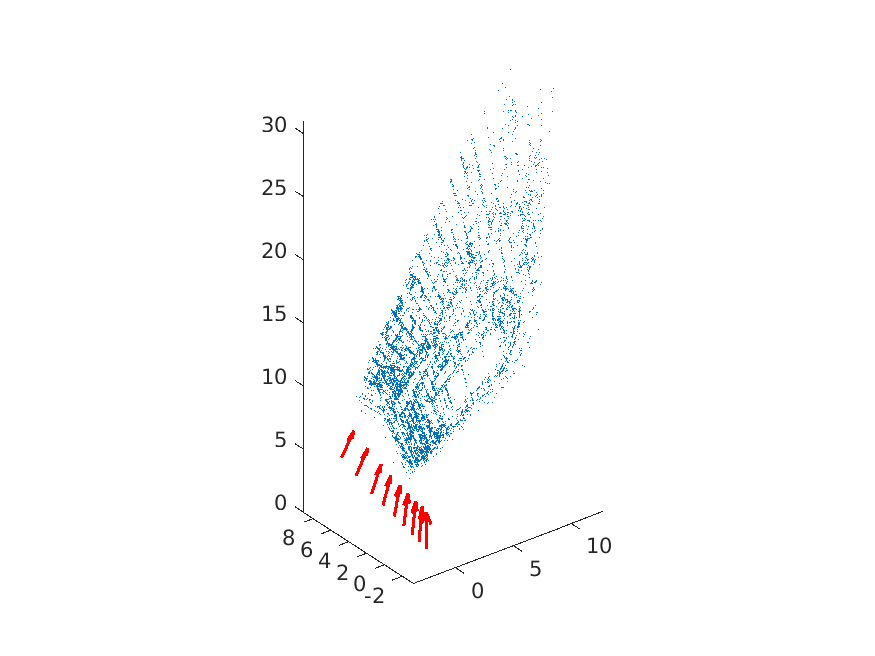
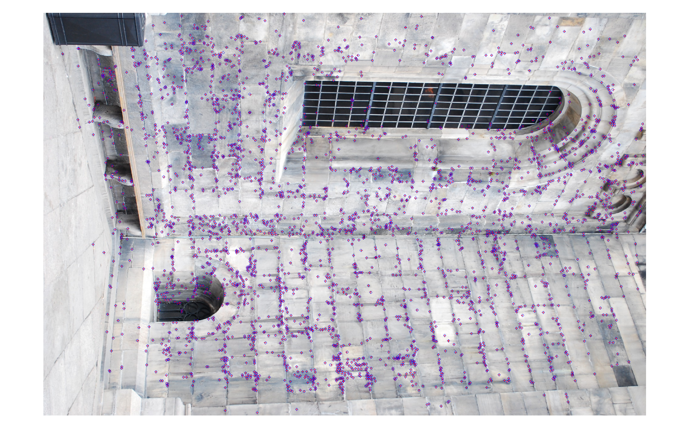
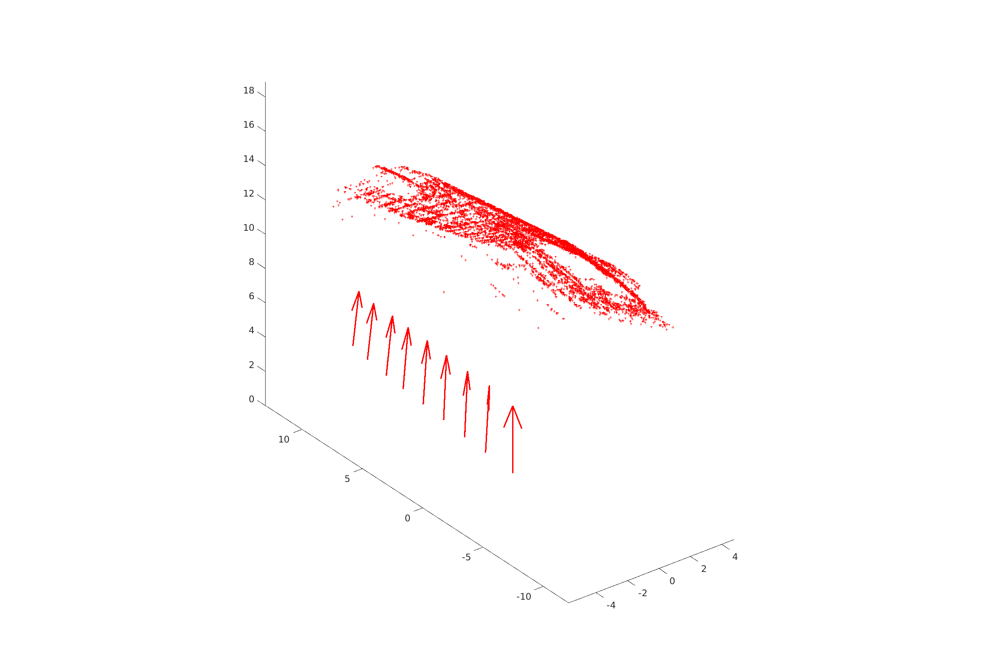
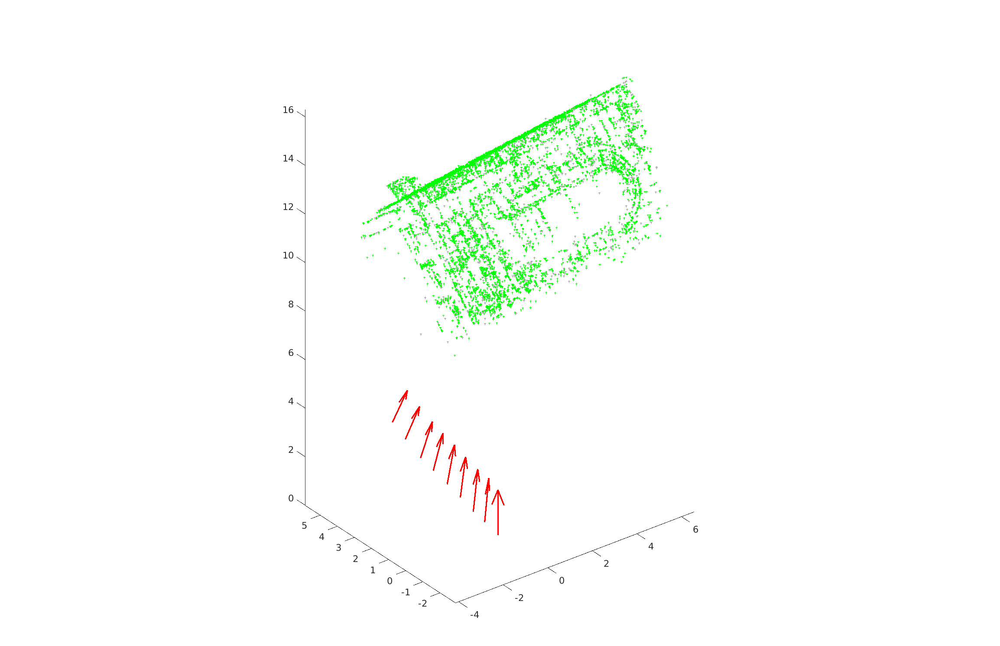
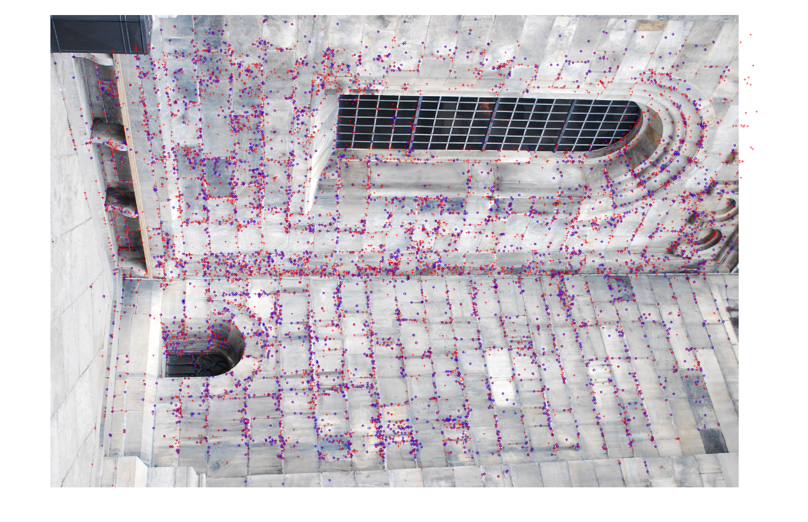
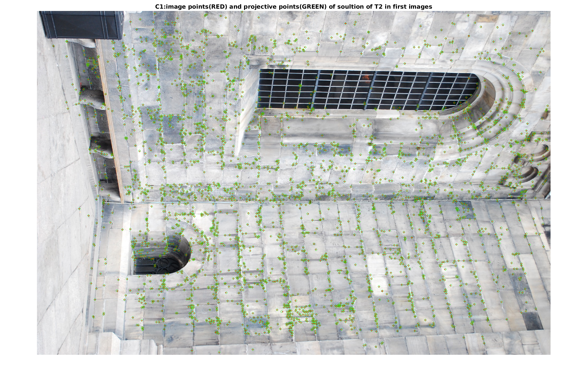

# Assignment 2
+ 2023-11-20
+ Honggang Chen, CID: chenhon 
---
### 2 Calibrated vs. Uncalibrated Reconstruction.
####  Theoratical exercise 1
+ (1)

For estimated points $X$ in 3D space and camera P, the projtective points in P is:
```math
  {\lambda}x = PX
```
For any projective transformation $T$ of 3D space to $X$, we have:
```math
  {\lambda}x = PX = PT^{-1}TX = (PT^{-1})(TX)
```
Then $PT^{-1}$ can be regared as a new camera and $X' = TX$ as the new reconstruction. This  means that given a soultion we can apply any projective transformation to the 3D points and obtain a new solution.

####  Computer Exercise 1
code file "run1.m" is for this task.
+ (1)
 
Plot the 3D points of the reconstruction.  
No, the physical properties doesn't look realistic.  
  

+ (2)
  
Plot the image, the projtective points and the image points in the same figure.  
(**Here I plot the first image**)  
Red '+' are projtective points from 3D points **X**. Blue 'o' are image points from **x**  
These points are matched very well.

  

+ (3)  

The 3D points has been streched and rotated. Solution of $T_2$ looks more reasonable now.  
$T_1X$ with cameras.  

  

$T_2X$ with cameras.  

   
<!-- Todo: answer for: what happened to the 3D points? Does any of them appear reasonable? -->

+ (4) 

Project $T_1X$  and $T_2X$ into new corresponding cameras. (Here we still choose the first view. Red '+' are projtective points from $T_iX$). From the ploted images, the projections and the image points align for the new reconstructions so well.  
$T_1X$ projtective points  

  

$T_2X$ projtective points  




####  Theoratical exercise 2
<!-- TODO: what is the same projective distortions mean? the distortions in images? or the reconstructions? -->
+ (1)

When we normalized the image coordinates using $K^{-1}$, then the problem becomes that of finding normalized cameras $[R|t]$ and 3D points $X$ such that：
```math 
{\lambda}x = (R|t)X
```
where $R$ is a rotation matrix. Given a solution $[R|t]$ and $X$, we can try to apply same transformation as exercise 1. However when multiplying $[R|t]$ with $T$, the result does not have a rotation matrix in the first 3x3 block. To achieve a valid solution T should be a similarity transformation. 
```math
  T= 
\begin{pmatrix}
sQ & v \\
0 & 1
\end{pmatrix}^{-1}X
``` 
Where Q is a ritation. Then we get:
```math 
  \frac{{\lambda}}{s}x = (R|t) 
  \begin{pmatrix}
    sQ & v \\
    0 & 1
  \end{pmatrix}^{-1} \~X = 
  (RQ|\frac{1}{s}(RV+t))X
```

which is a valid solution since RQ is a rotaion. Hence, we do not have the same distrtion since similarity transformations preserve angles and parallel lines. But there is still similarity ambiguity to the reconstruction. 

---
### 3 Camera Calibration
####  Theoratical exercise 3
+ (1)
Because $T*T^{-1}=I$, we can esaIly verify it like:
```math 
  K*K^{-1} = 
\begin{pmatrix}
f & 0 & x_0 \\
0 & f & y_0 \\
0 & 0 & 1 
\end{pmatrix} 
\begin{pmatrix}
1/f & 0 & -x_0/f \\
0 & 1/f & -y_0/f \\
0 & 0 & 1 
\end{pmatrix} =
\begin{pmatrix}
1 & 0 & 0 \\
0 & 1 & 0 \\
0 & 0 & 1 
\end{pmatrix} = I  
```

+ (2) 
Similary as above, we have:
```math 
  A * B = 
\begin{pmatrix}
1/f & 0 & 0 \\
0 & 1/f & 0 \\
0 & 0 & 1 
\end{pmatrix}
\begin{pmatrix}
1 & 0 & -x_0 \\
0 & 1 & -y_0 \\
0 & 0 & 1 
\end{pmatrix}
= 
\begin{pmatrix}
1/f & 0 & -x_0/f \\
0 & 1/f & -y_0/f \\
0 & 0 & 1 
\end{pmatrix} = K^{-1}
```
+ (3)
The geometric interpretation of the transformations A and B is to
move a point $(x,y)$ by adding vercotr $(-x_0,-y_0)$ (what A does.), then scale it with factor $1/f$ in both x and y directions( what B does.).

+ (4)
The interprtation of this operation is to conver the points from sensor coordination system back to image coordination system. The principal point $(x_0,y_0)$ ended up at $(0, 0, 1)$ . A point with distance f to the pricipal point ended up at a cycle whoes center is at $(0,0,1)$ and radius is 1.
<!-- todo, meaning the point is at a cycle? -->


+ (5)

We can get $K^{-1}$:
```math 
K^{-1} = 
\begin{pmatrix}
1/400 & 0 & -1 \\
0 & 1/400 & -0.75 \\
0 & 0 & 1 
\end{pmatrix}
```
So the normalize points are:
```math 
(0,300) \sim (-1, 0,1)
 ```
```math 
(800,300) \sim (1,0,1)
 ```
Let A denotes $(-1, 0,1)$, B denotes $(1,0,1)$,$\theta$ denotes the angle of two viewing rays:
``` math 
\theta = arcos(\frac{A \cdot B}{\|A\|\|B\|}) = \frac{\pi}{2}
```

+ (6)
<!-- Todo: how to prove it? -->
For camera $[R|t]$, assuming its center is $C$, then we have:
```math 
  [R|t]C = 0
```
Now, for camera $K[R|t]$, apply it to $C$, we have:
```math
  K[R|t]C = K ([R|t] C) = K 0 = 0 
```
So camera $K[R|t]$ has same camera center as camera $[R|t]$.

As for the principal axis of camera $[R|t]$, we have
```math
  RX = (0,0,1)^T
```
Thus:
```math
  X = R^T(0,0,1)^T =  (R_{3,1}, R_{3,2}, R_{3,3})^T
```
Where $i,j$ is the index of rows and colums of R.

Then for camera $P=K[R|t]$, we have
```math
  P_{3,3} = KR
```
because $K$ is an up triangle metric, so we have:
```math
  P_{3,3} = 
\begin{pmatrix}
K_{11} & K_{12}  & K_{13} \\
0 & K_{22} & K_{23} \\
0 & 0 & 1 
\end{pmatrix}
\begin{pmatrix}
R_{11} & R_{12} & R_{13} \\
R_{21} & R_{22} & R_{23} \\
R_{31} & R_{32} & R_{33} 
\end{pmatrix}
=
\begin{pmatrix}
P_{11} & P_{12} & P_{13} \\
P_{21} & P_{22} & P_{23} \\
R_{31} & R_{32} & R_{33} 
\end{pmatrix}
```
We can notice that the last row of P still same as R, thus
the solution for $P_{33}X=(0,0,1)^T$ is same as above. So, both camera (normalzed or not) have the same principle axis.


---
### 4 RQ Factorization and Computation of K
####  Theoratical exercise 4

+ (1)
<!-- TODO what doest R1^T mean? -->
```math
  KR = 
  \begin{pmatrix} 
  a & b & c \\
  0 & d & e \\
  0 & 0 & f
  \end{pmatrix}
  \begin{pmatrix} 
  r_{11} & r_{12} & r_{13} \\
  r_{21} & r_{22} & r_{23} \\
  r_{31} & r_{32} & r_{33}
  \end{pmatrix}  \\
  = 
  \begin{pmatrix} 
  a*r_{11} + b*r_{21} + c*r_{31} & a*r_{12} + b * r_{22} + c* r_{32} & a*r_{13}+b*r_{23}+c*r_{33} \\
  d* r_{21} + e * r_{31} & d* r_{22} + e * r_{32} & d * r_{23} + e *r_{33}  \\
  f * r_{31} &  f* r_{32} & f*r_{33}
  \end{pmatrix} \\
  =
  \begin{pmatrix} 
  a*(r_{11},r_{12},r_{13}) + b*(r_{21} ,r_{22} , r_{23}) + c*(r_{31} , r_{23} , r_{33}) \\
  d*(r_{21},r_{22} ,r_{23}) +   e*(r_{31},r_{32}, r_{33})  \\
  f*(r_{31},r_{r2}, r_{33})
  \end{pmatrix}  
  =  
  \begin{pmatrix} 
  aR_1^T + bR_2^T + cR_3^T \\
  dR_2^T + eR_3^T \\
  fR_3^T
  \end{pmatrix}
```
+ (2)

Because $\|R_3\| = 1$, so $f= \|P_{3,:}\|  = 1$, thus, $R_3= (\frac{1}{\sqrt2},0,-\frac{1}{\sqrt2})$.

+ (3)

If $P_{2,:} = v = dR_2 + eR_3$, let $\theta$ denotes the angele of $v$ and $R_3$, and $\|R_3\|=1$ we have:
```math
  cos({\theta}) = \frac{R_3 \cdot v^T }{\|R_3\|\|v\|} = 
  \frac{R_3 \cdot v^T }{\|v\|}
```
Because $R_2 \perp R_3$, we can get $e$ from:
```math 
 e  = cos({\theta}) * \|v\| = R_3 \cdot v^t = (\frac{1}{\sqrt2}, 0 , -\frac{1}{\sqrt2} ) (700\sqrt2, 2800 , -700\sqrt2)^T = 1400
```
Thus $R_2 = v - e R_3 = (0, 2800, 0)$, and becuase $\|R_2\| = 1$, then $d = 2800$ and $R_2 = (0,1,0)$ 

+ (4)

Similarly, we can get $b$ and $c$:
```math 
  c = R_3 \cdot P_{1,:}^T  = 1600 
```
```math 
  b = R_2 \cdot P_{1,:}^T  = 0
```
Then $a = 3200$, $R_1 = (\frac{1}{\sqrt2}, 0 ,\frac{1}{\sqrt2})$
Thus:
```math
  f_{length} = 2800
```
```math
  aspect  = 1.143
```
```math
  printcipal \ point = (1600,1400) 
```

---
### 5 Direct Linear Transformation DLT
####  Theoratical exercise 5

+ (1)
For any $M$, when $v=\mathbf{0}$, $Mv = \mathbf{0}$, then $\|Mv|\^2 = 0$. Thus $\underset{v}{min}\|Mv\|^2$ always has the minimum value 0.

+ (2)

Because $M=U{\Sigma}V^T$, and U,V are orthogonal, ${\Sigma}$ is a diagonal matrix, which mean $U^TU=I$, $V^TV=I$, then:
```math
\begin{align}
\|Mv\|^2 & = (Mv)^T(Mv) = (v^TM^T)(Mv)\\
& = v^T(U{\Sigma}V^T)^T(U{\Sigma}V^Tv) \\
&=  v^T V(U{\Sigma})^T(U{\Sigma}V^Tv) \\
&=  v^T V {\Sigma}^T U^T U {\Sigma} V^Tv \\
&=  v^T V {\Sigma}^T {\Sigma} V^Tv \\
\end{align}
```
Let $w$ denotes ${\Sigma}V^Tv$, then $w^T =  v^TV{\Sigma^T}$.
With (5) above:
```math
\begin{align}
\|Mv\|^2 & = w^Tw  = \|w\|^2 = \| {\Sigma}V^Tv \| ^2
\end{align}
```
When if $\|v\|^2=1$, then :
```math
\|V^Tv\| = (V^Tv)^T(V^Tv) = v^TVV^Tv = v^Tv = \|v\|^2 = 1
```

+ (3)

From (2), we get
```math
  \underset{\|v\|^2=1}{min}\|Mv\|^2 =  \underset{\|v\|^2=1}{min}\|{\Sigma}V^Tv\|^2.
```
Let $w$ denotes $V^Tv$, because $v$ is an unit vector, and V is orthogonal, so $w$ is a unite vector. Thus:
```math
  \underset{\|v\|^2=1}{min}\|{\Sigma}V^Tv\|^2 = \underset{\|w\|^2=1}{min}\|{\Sigma}w\|^2
```
So, $\underset{\|\~v\|^2=1}{min}\|{\Sigma}V^T\~v\|^2$ gives the same minimal value as $\underset{\|v\|^2=1}{min}\|Mv\|^2$.
And because $\|Mv\|^2 = \|M(-v)\|^2$, $\|v\| = \|-v\|$, there are at least two solutions to these problems.

+ (4)

If M has SVD then:
```math
M^TM=(USV^T)^T(USV^T)  = VS^TU^TUSV^T = VS^TSV^T
```
Since $S^TS$ is a diagnoal matrix this menas that V diagonalizes $M^TM$ and therefore $S^TS$ contains the eigenvalues and V contains the eigenvectors of $M^TM$.  The diagonal elements of $S^TS$ are ordered decreasingly. Thus to find an eigenvector corresponding to the smallest eigenvalue we should select the last column of V. 

####  Theoratical exercise 6

+ (1)

```math
P = N^{-1}\~P
```
####  Computer Exercise 2