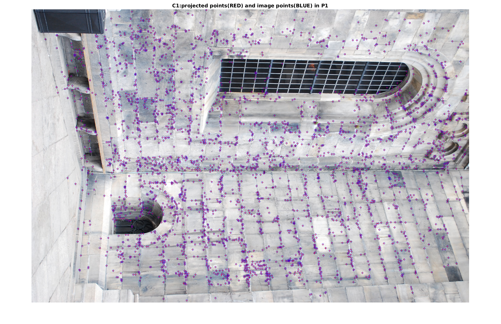
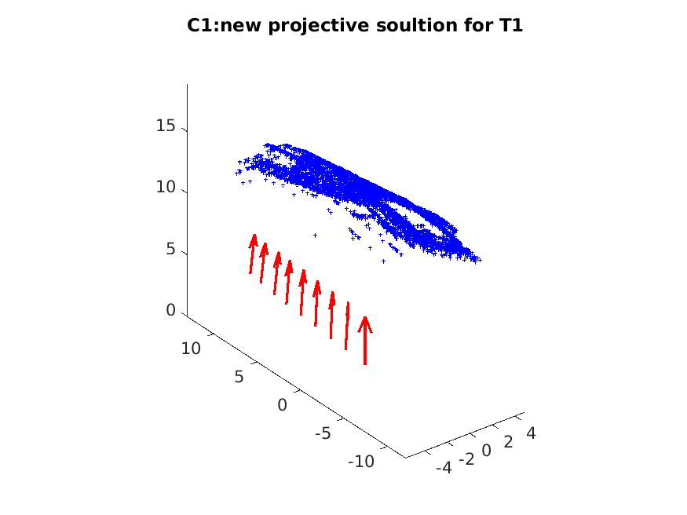
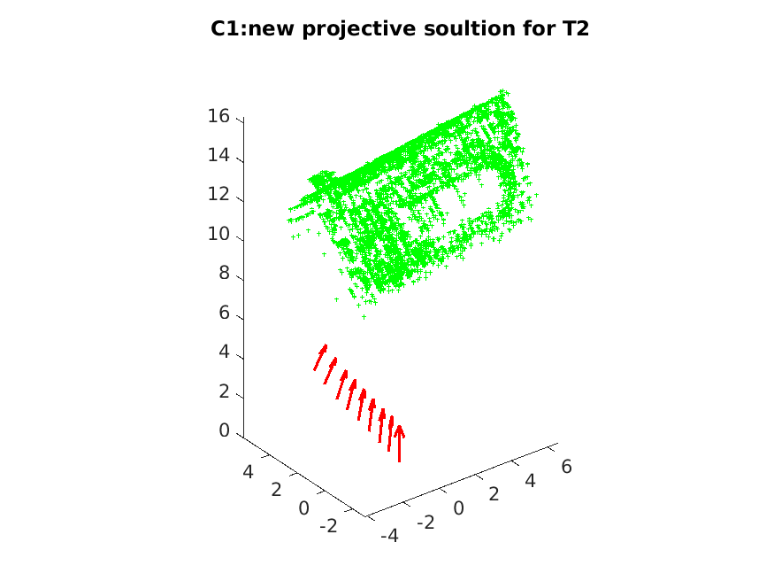

# Assignment 2
+ 2023-11-20
+ Honggang Chen, CID: chenhon 
---
### 2 Calibrated vs. Uncalibrated Reconstruction.
####  Theoratical exercise 1
+ (1)

For estimated points $X$ in 3D space and camera P, the projtective points in P is:
```math
  {\lambda}x = PX
```
For any projective transformation $T$ of 3D space to $X$, we have:
```math
  X' = TX
```
Then:
```math
  {\lambda}x = PX = PT^{-1}TX = (PT^y{-1})(TX)
```
Where $PT^{-1}$ is the new camera for the new 3D points $X'$.

####  Computer Exercise 1
code file "run1.m" is for this task.
+ (1) 
plot the 3D points of the reconstruction.  
No, the physical properties doesn't look realistic.  
  

+ (2)  
plot the image, the projtective points and the image points in the same figure.  
(**Here I plot the first image**)  
red + are projtective points from 3D points **X**. blue o are image points from **x**  
These points are matched very well.
  

+ (3)  
$T_1X$ with cameras.  
  
$T_2X$ with cameras.  
  
<!-- Todo: answer for: what happened to the 3D points? Does any of them appear reasonable? -->

+ (4)  
Project $T_1X$  and $T_2X$ into new corresponding cameras. (Here we still choose the first view. Red '+' are projtective points from $T_iX$)  
$T_1X$ projtective points  
  
$T_2X$ projtective points  

