# Assignment 2
+ 2023-12-3
+ Honggang Chen, CID: chenhon 
---
### The Fundamental Matrix
####  Theoratical exercise 1
+ (1)
```math
F= [t]_xA = 
\begin{pmatrix}
 0 & 0 & 2 \\
 0 & 0 & -2 \\
 -2 & 2 & 0
\end{pmatrix}
\begin{pmatrix}
1 & 1 & 0 \\
0 & 1 & 0 \\
0 & 0 & 1
\end{pmatrix}
=
\begin{pmatrix}
0 & 0 & 2 \\
0 & 0 & -2 \\
-2 & 0 & 0
\end{pmatrix}
```
+ (2)
```math
l_2 = F \begin{pmatrix} x^T \\ 1 \end{pmatrix} =  (2,-2,0)^T
```

+ (3)
(1,1) could be a projection of the same point X into $P_2$, because $y^TFx=0$

####  Theoratical exercise 2
+ （1）

We can get $P_2$ camera center $C_2$:
```math 
  C_2 = -P_{2_{3,3}}^{-1}*P_{2_4} =  (1,-2,0)^T 
```
Thus epipoles $e_1$:
```math 
  e_1 = P_1 \begin{pmatrix} C_2 \\ 1 \end{pmatrix} = (I|0)
  \begin{pmatrix} C_2 \\ 1 \end{pmatrix} = C_2 = (1,-2,0)^T
```
And $C_1= 0$,thus
```math 
  e_2 = P_2  \begin{pmatrix} C_1 \\ 1 \end{pmatrix} = P_{2_4} = (2,1,0)^T
```

+ (2)

```math 
F= [t]_xA= [P_{2_4}]_xP_{2_{3,3}} = \\
\begin{pmatrix}
 0 & 0 & 1 \\
 0 & 0 & -2 \\
 -1 & 2 & 0
\end{pmatrix}
\begin{pmatrix}
0 & 1 & 1 \\
3 & 2 & 0 \\
0 & 0 & 3
\end{pmatrix}
=
\begin{pmatrix}
0 & 0 & 3 \\
0 & 0 & -6 \\
6 & 3 & -1
\end{pmatrix}
```
verify $e_2^TF=0$
```math 
e_2^TF = (2,1,0) \begin{pmatrix}
0 & 0 & 3 \\
0 & 0 & -6 \\
6 & 3 & -1
\end{pmatrix}
= (0, 0, 0)
```
verify $Fe_1=0$
```math 
Fe_1 =\begin{pmatrix}
0 & 0 & 3 \\
0 & 0 & -6 \\
6 & 3 & -1
\end{pmatrix} (1,-2,0)^T
= (0, 0, 0)^T
```

####  Theoratical exercise 3（optional）
+ (1)
Because
```math
P_2 (C_2^T|1)^T = (A|t)(C_2^T|1)^T = 0 
```
Thus
```math
 C_2 = -A^{-1}t 
```
Thus
```math
 e_1 \sim P_1 (C_2^T|1)^T = (I|0)(C_2^T|1)^T = C_2 = -A^{-1}t
```
And because $C_1 = 0$
```math 
e_2 \sim P_2 (0^T|1)^T = (A|t)(0^T|1)^T = t
```
+ (2)
  
Because
```math
\begin{align} 
F^Te_2 &= ([t]_xA)^Te_2 = A^T[t]_x^Te_2 \\
&= -A^T[t]_xe_2= -A^T[e_2]_xe_2 = -A^T([e_2]_xe_2) \\
&= -A^T(e_2 \times e_2) = -A^T (0) = 0
\end{align}
```
Thus:
```math 
e_2^TF = (F^Te_2)^T = 0
```
And
``` math 
Fe_1 = [t]_xAe_1 = [t]_xA (-{\lambda} A^{-1}t)  = [t]_xAA^{-1}t = t \times t = 0
```

+ (3)
Because we know $e_1!=0$, and only when $det(F) = 0$, which means $F$ is a singluar matrix, there exist non-zero soultion for problem $Fe_1 = 0$.
<!-- todo -->

####  Theoratical exercise 4
+ (1)

```math
F = N_2^T\~FN_1
```

####  Computer exercise 1
code run1.m is for this exercise. comment line 15-24 to run for part 1 and part 2. 
##### Part 1
+ (1) normalization matrices $N_1$, $N_2$
```matlab
N_1 =

    0.0024         0   -2.0255
         0    0.0030   -2.0046
         0         0    1.0000

N_2 =

    0.0022         0   -1.6745
         0    0.0029   -1.9181
         0         0    1.0000
```

+ (2) estimate_F_DLT 

normalized F
```matlab
  bF_n =
      0.1532   13.3245  -35.0541
    -16.0833   -0.7902  184.6120
    40.9953 -186.5937    1.0000
``` 
verify $\~x_2^T\~F\~x_1=0$
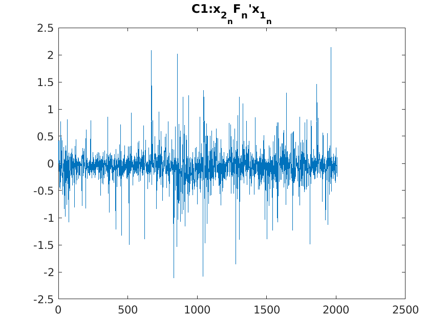

unormalized $F$:
```matlab
  F =

    -0.0000   -0.0000    0.0058
      0.0000    0.0000   -0.0267
    -0.0072    0.0263    1.0000
```

+ (3) epiploar lines with points 


**mean distance: 0.3612**

historgram with 100 bins
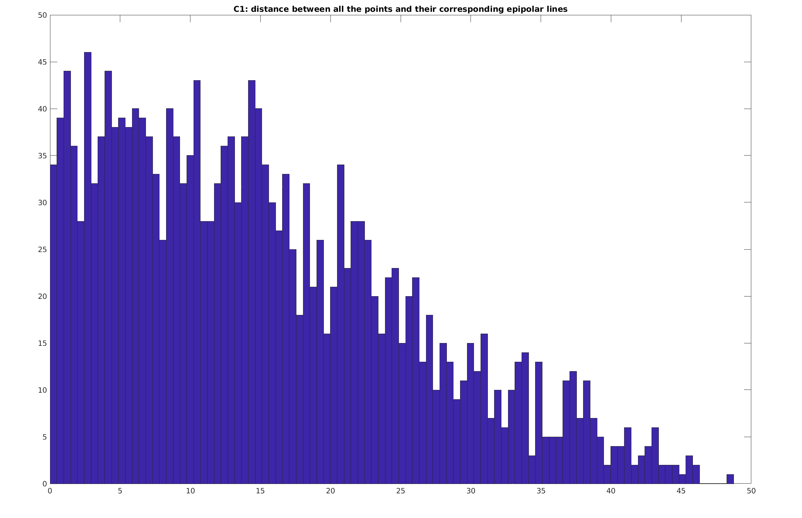

##### Part 2
+ (1) unormalized $F$:
```matlab
  F =
   -0.0000   -0.0000    0.0058
    0.0000    0.0000   -0.0266
   -0.0072    0.0262    1.0000
```
+ (2) 
verify $\~x_2^T\~F\~x_1=0$

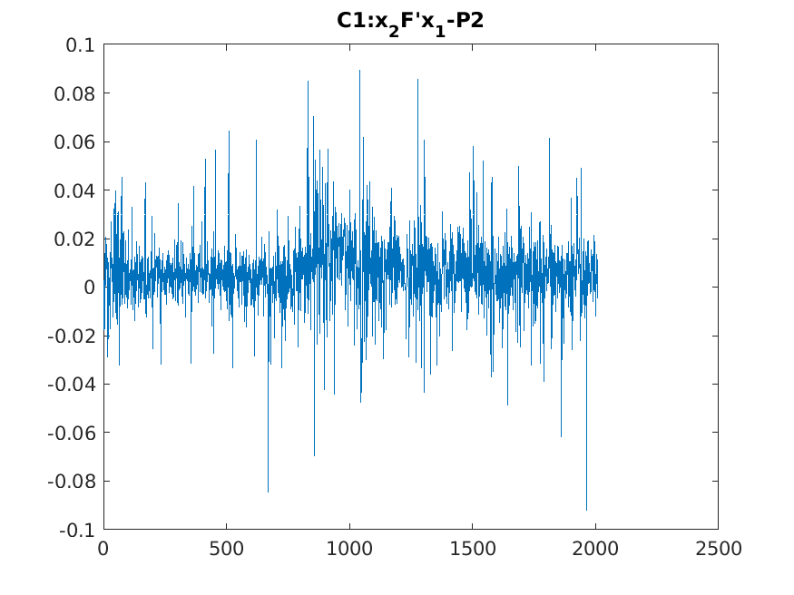

**mean distance: 0.4878**

historgram with 100 bins
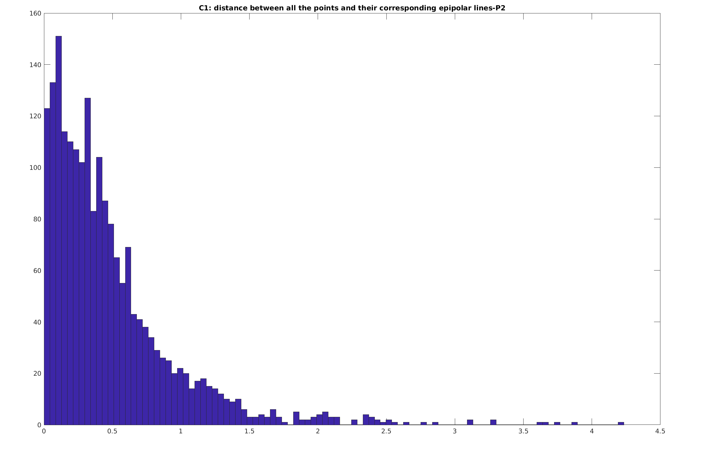

####  Theoratical exercise 5

let $x_1$,$x_2$ denotes the prjection of the scene point into $P_1$ and $P_2$ respectively.
Then we have 
```math 
x_1 \sim  P_1 [X^T|1]^T = [I|0][X^T|1]^T = X
```
```math
x_2 \sim P_2 [X^T|1]^T = [[e_2]_xF | e_2] [X^T|1]^T =
[e_2]_xFX + e_2  
```
Therefore:
```math 
\begin{align}
x_2^TFx_1 &\sim ([e_2]_xFX + e_2 )^T FX \\ 
 &= ([e_2]_xFX)^T FX + e_2^TFX \\
 &= -(FX)^T[e_2]_x(FX) + (F^Te_2)^TX

\end{align}
```
Because $F^Te_2=0$, and $(FX)^T[e_2]_x(FX) = 0$, Thus
```math 
x_2^TFx_1  = 0
```
The projection of these points will fulfill the epipolar constraints.

let $C_2$ denotes $P_2$ camera center:
```math
P_2 \begin{pmatrix} C_2 \\ \mu \end{pmatrix} = [e_2]_xFC_2 + {\mu}e_2 = 0 
```
Because $e_1 \sim C_2$, Then 
```math
[e_2]_xFC_2 + {\mu}e_2 \sim [e_2]_xFe_1 + {\mu}e_2 = 0
```
Because $Fe_1 = 0$, then $\mu=0$, and $P_2$ camera center is
```math
 \begin{pmatrix}e_1 \\ 0\end{pmatrix}
``` 
<!-- todo how to get e_1? -->
We can get $e_2$ by computing the null space of $F^T$.
First apply elimination to $F^T$, we get 
```math 
  U \sim 
  \begin{pmatrix}
  0 & 2 & 0 \\
  1 & 0 & 1 \\
  1 & 4 & 1 
  \end{pmatrix} \sim  
  \begin{pmatrix}
  1 & 0 & 1 \\
  0 & 1 & 0 \\
  0 & 0 & 0
  \end{pmatrix}
```
Thus $e_2 = (-1,0,1)^T$.
Same, we can get $e_1$, because $e_1 \in null(F)$. $e_1 = (-2,-1,1)^T$


### The Essential Matrix
####  Theoratical exercise 6
+ （1）

We have:
```math 
  [t]_x^T[t]_x = (USV^T)^T(USV)= VSU^TUSV^T= VS^TSU = VS^2V^T
```
Therefore the eigenvalues of $[t]_x^T[t]_x$ are the squared singular values. 

+ (2)


#### Computer exercise 2
code file run2.m is for this exercise.
 + (1) Essential matrix
  ```matlab
    bE_n =
      0.0032    0.3619   -0.1357
    -0.4507   -0.0282    0.8808
      0.1701   -0.9176   -0.0004
  ```
 + (2) $\~x_2^TE\~x_1 = 0$

  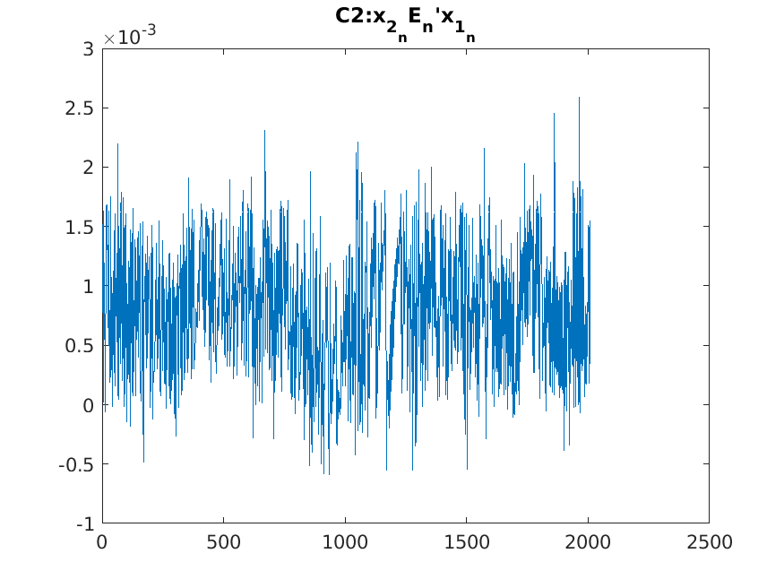

 + (3) the fundamental matrix
  ```matlab
   F=
     -0.0000   -0.0000    0.0066
      0.0000    0.0000   -0.0303
     -0.0082    0.0299    1.0000
  ```

  + (4) epiploar lines with points 
  
  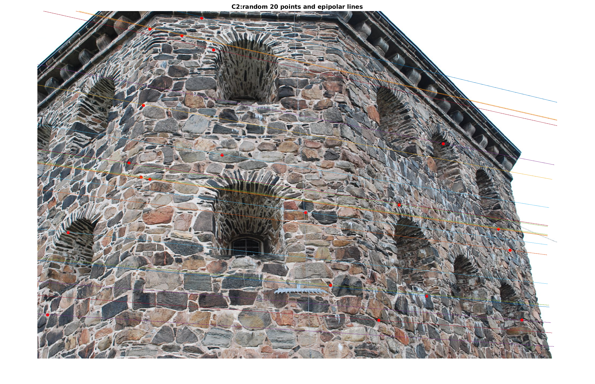

  + (5) mean distance 2.0838

  + (6) histogram 
  
  The distribution of the histogram about distance in computer exercise 2 is more dispersed than that in computer exercise 1.
  |computer exercise 2|computer exercise 1|
  |-|-|
  |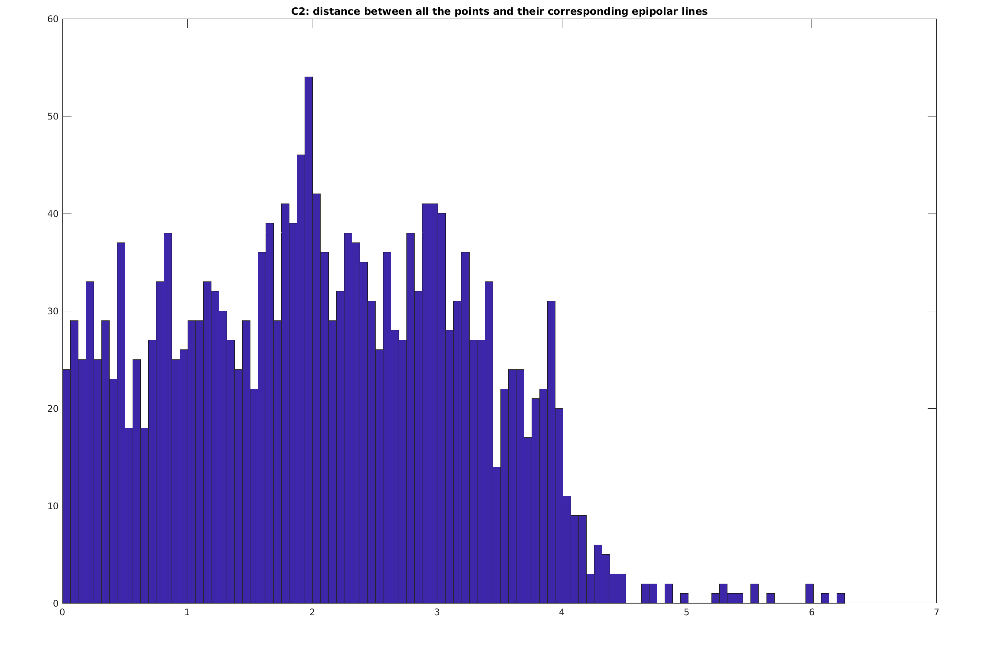||

   

####  Theoratical exercise 7
+ (1)

```math
UV^T=
\begin{pmatrix}
 -1/{\sqrt2} & -1/{\sqrt2} & 0 \\
 -1/{\sqrt2} & 1/{\sqrt2} & 0 \\
  0 & 0 & 1
\end{pmatrix}
\begin{pmatrix}
 -1 & 0 & 0 \\
 0 & 0 & -1 \\
  0 & 1 & 0
\end{pmatrix}
= 
\begin{pmatrix}
1/{\sqrt2} & 0 & 1/{\sqrt2} \\
1/{\sqrt2} & 0 & -1/{\sqrt2} \\
0 & 1 & 0 \\
\end{pmatrix}
```
```math 
det(UV^T) = (1/{\sqrt2}*0*0) + (0*-1/{\sqrt2}*0)+ (1/{\sqrt2} * 1/{\sqrt2} * 1) \\
          - (1/{\sqrt2}*0 *0) - (0*1/{\sqrt2}*0) - (1/{\sqrt2} * -1/{\sqrt2} * 1)
          = 1
```
+ (2)

```math
  E=Udiag([1,1,0])V^T = 
  \begin{pmatrix}
 -1/{\sqrt2} & -1/{\sqrt2} & 0 \\
 -1/{\sqrt2} & 1/{\sqrt2} & 0 \\
  0 & 0 & 1
\end{pmatrix}
\begin{pmatrix}
 1 & 0 & 0 \\
 0 & 1 & 0 \\
 0 & 0 & 0
\end{pmatrix}
\begin{pmatrix}
 -1 & 0 & 0 \\
 0 & 0 & -1 \\
  0 & 1 & 0
\end{pmatrix}
=
\begin{pmatrix}
 1/{\sqrt2} & 0 & 1/{\sqrt2} \\
 1/{\sqrt2} & 0 & -1/{\sqrt2} \\
  0 & 0 & 0
\end{pmatrix}
```
Becasue
```math
\begin{pmatrix}
x_2^T \\
1
\end{pmatrix}^T 
E
\begin{pmatrix}
x_1^T \\
1
\end{pmatrix}
= 
(1,-3,1) E (2,0,1)^T = 0
```
$x_1$ $x_2$ is a plausible correspondence.

+ (3)
```math
\begin{pmatrix}
x_1^T \\
1
\end{pmatrix} 
\sim
P_1 X = [I|0]
\begin{pmatrix}
X_{(1:3,1)} \\
X_{(4,1)}
\end{pmatrix} 
= 
X_{(1:3,1)} +  0*X_{(4,1)}
```
Thus $X_{(4,1)}$ can be any value $s$, which means $X \in X(s)$

+ (4)

From the context, we know:
``` math
\begin{pmatrix}
x_2^T \\
1
\end{pmatrix}
\sim 
P_2X(s) = 
P_{2_{(:,1:3)}} (2,0,1)^T + P_{2_{(:,4)}}s
```
And $u_3=(0,0,1)^T$.
For $P_2=[UWV^T|u_3]$, we have:
```math
\begin{pmatrix}
1 \\
-3 \\
1
\end{pmatrix}
\sim 
\begin{pmatrix}
1/{\sqrt2} & 0 & -1/{\sqrt2}\\
-1/{\sqrt2} & 0 & -1/{\sqrt2} \\
0 & 1 & 0
\end{pmatrix}
\begin{pmatrix}
  2 \\ 
  0 \\
  1 
\end{pmatrix}
+ 
\begin{pmatrix}
 0 \\
 0 \\
 1
\end{pmatrix}
s=
\begin{pmatrix}
 1/{\sqrt2} \\
 -3/{\sqrt2} \\
 s
\end{pmatrix}
```
Thus $s=1/{\sqrt2}$

For $[UWV^T|-u_3]$, same as above, we have
```math 
\begin{pmatrix}
1 \\
-3 \\
1
\end{pmatrix}
\sim 
\begin{pmatrix}
 1/{\sqrt2} \\
 -3/{\sqrt2} \\
 -s
\end{pmatrix}
```
Thus $s=-1/\sqrt2$.

For $[UW^TV^T|u_3]$:
```math
\begin{pmatrix}
1 \\
-3 \\
1
\end{pmatrix}
\sim 
\begin{pmatrix}
-1/{\sqrt2} & 0 & 1/{\sqrt2}\\
1/{\sqrt2} & 0 & 1/{\sqrt2} \\
0 & 1 & 0
\end{pmatrix}
\begin{pmatrix}
  2 \\ 
  0 \\
  1 
\end{pmatrix}
+ 
\begin{pmatrix}
 0 \\
 0 \\
 1
\end{pmatrix}
s=
\begin{pmatrix}
 -1/{\sqrt2} \\
 3/{\sqrt2} \\
 s
\end{pmatrix}
```
Thus $s = -1/\sqrt2$.
Similar for $P_2=[UW^TV^T | -u_3]$, we can get $s=1/\sqrt2$.

<!-- ? the first one and the forth one ? -->


####  Computer exercise 3
code file run3.m is for this exercise.

+ (1)
The forth one in 4 solutions is that the points are in front of the cameras.

|P2_1|P2_2|P2_3|P2_4|
|-|-|-|-|
|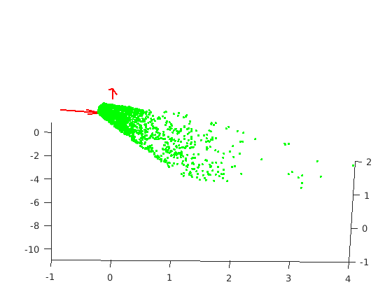|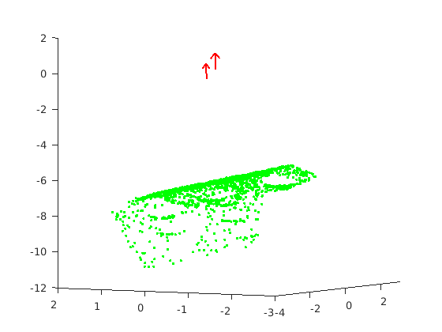||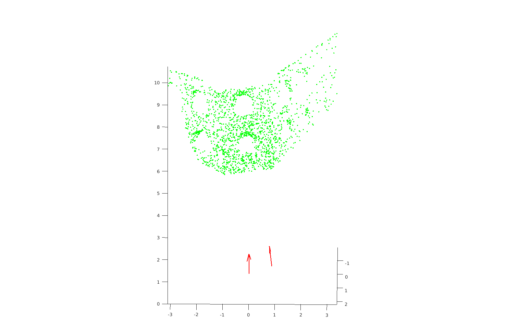|

+ (2) project X into image.

error is: 1.1927  
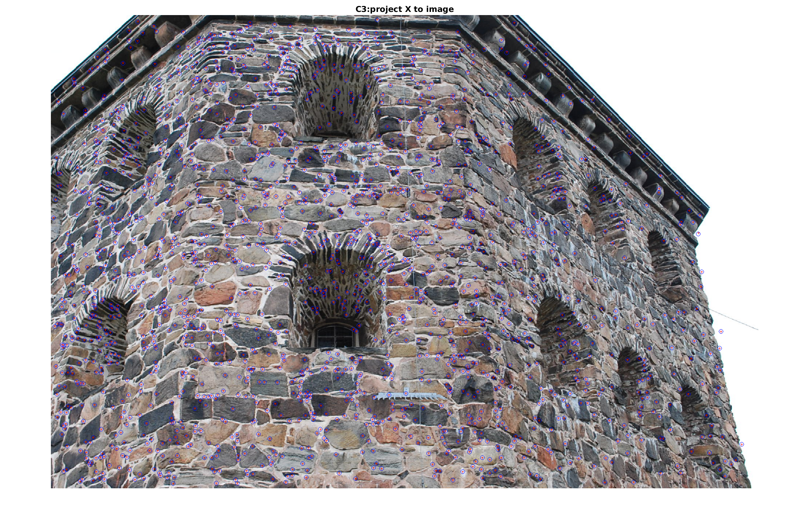

+ (3)

The result appears quite reasonable, with the lines maintaining the expected parallel and vertical relationship.

