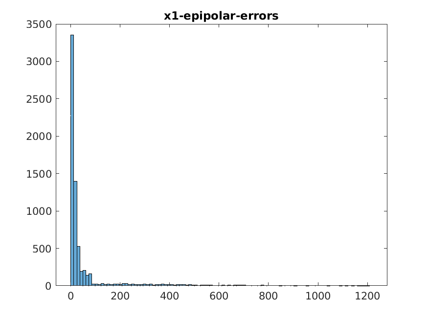
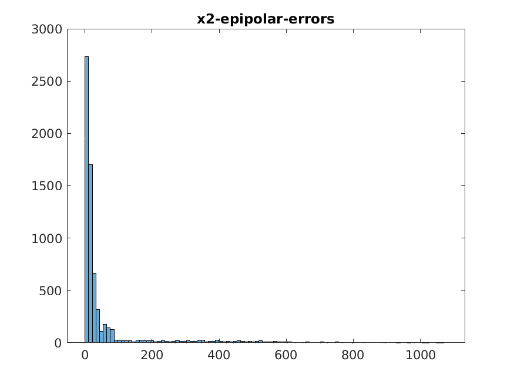
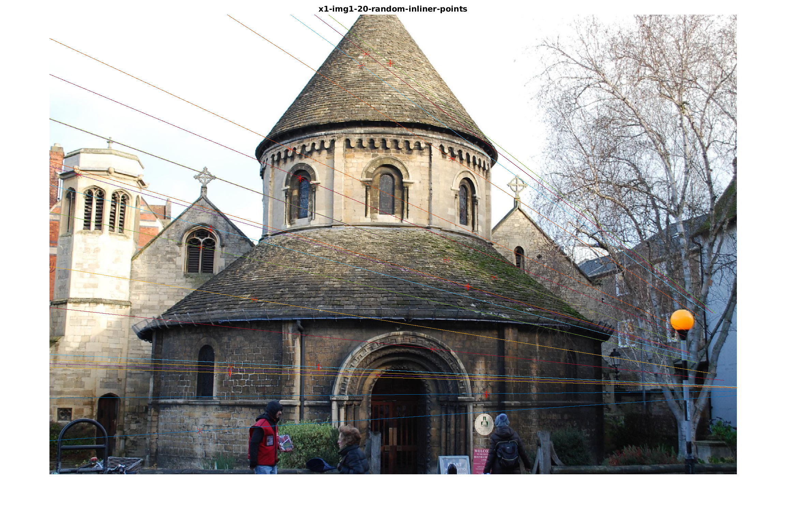
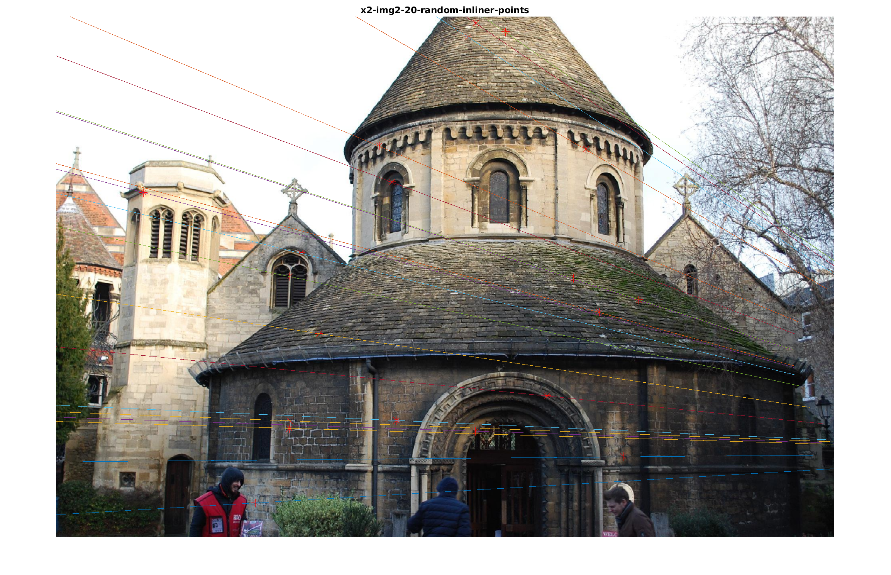
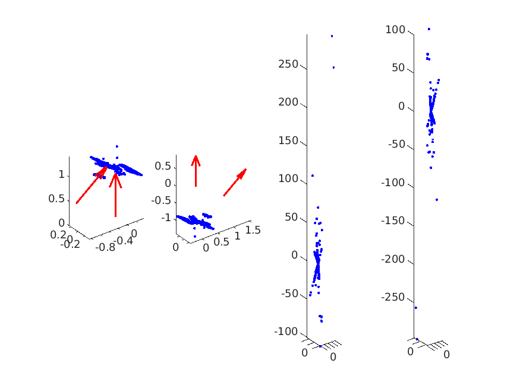
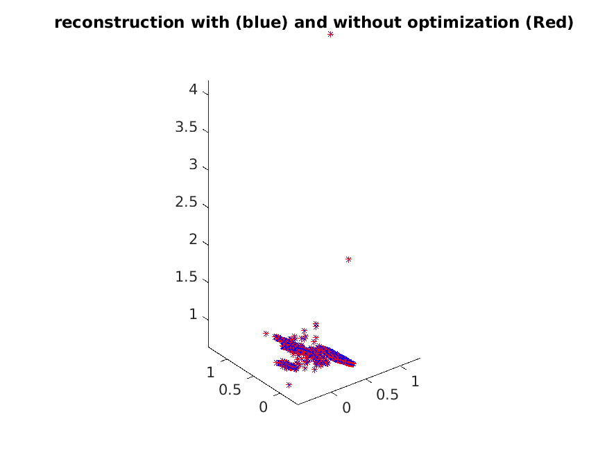

## Assignment 2
+ 2023-12-3
+ Honggang Chen, CID: chenhon 
---
### Roubust Epipolar Geometry and Two-View Reconstruction
####  Theoratical exercise 1

+ (1)

First, we can apply a similary transformation $H$ to $P_1$ and $P_2$ to make $P_1' = P_1' H = [I|0]$, where $I$ is the identity matrix, and H:
```math
  H = \begin{pmatrix}
  R_1^T & -R_1^Tt_1 \\
  0 & 1
  \end{pmatrix}
```
Thus, $P_2' = P_2 H = [R_2 R_1^T | -R_2 R_1^T t_1 + t_2]$.
Let $R_2'$ denotes $R_2 R_1^T$, $t_2'$ denotes $-R_2 R_1^T t_1 + t_2$. The essential matrix will be $E=[t_2']_x R_2' = [-R_2 R_1^T t_1 + t_2]_x R_2R_1^T$.

####  Theoratical exercise 2
run1.m is for this exercise.
+ (1)
  
An essential matrix has 5 degrees of freedom.

+ (2)

we need at least 5 point correspondences to determine E(5 points method). But by the eight point solver we need 8 point correspondences. 

+ (3)

44 iterations we need.

####  Computer exercise 1

+ RMS (with all points)

```matlab
erms =

  155.9583


mean_error_l1 =

   61.3336


mean_error_l2 =

   63.4689
```

+ histograms with 100 bins for the epipolar errors in both images




+ 20 points and epiploar lines in both image

Not all points are close to the epipolar lines. And the plots look unreasonable. 


+ Using RANSAC, We get 5516 inliners

```matlab
inliner_number =

        5516
```

+ RMS (RANSAC)

```matlab
ransac_erms =

  209.5010


ransac_mean_error_l1 =

   58.9546


ransac_mean_error_l2 =

   71.7826
```

+ histograms with 100 bins for the epipolar errors in both images (RANSAC). The second (E estimated by RANSAC) version is better, because 
the error distribution is more concentrated. Although, the RMS error and mean epipolar error are larger than before. (it is because when we calculated the RMS and mean error with data including outlier.)

.png)
.png)

+ 20 points (pick from inliners) and epiploar lines in both image






####  Computer exercise 2
run2.m and extract_matched_points.m are for this exercise

+ (1) we get 26372 fetatures for image-1, 25600 for image-2, and 2161 macthes 

+ (2) we get 1452 inliers.

+ (3) 4 solution



from figures above, the first soulution is correct to me. 


### Levenberg-Marquardt for Structure from Motion Problems

####  Theoratical exercise 3

+ (1)

let $Z_{ij}=P_iX_j$, then

``` math
r_i(X_j) = (x_{ij,1} - \frac{Z_i^1}{Z_i^3},
x_{ij,2} - \frac{Z_i^2}{Z_i^3})
```

Because $J_i(X_j) = \nabla r_i(X_j)$ and:
```math
\nabla r_i(X_j) = (\frac{\partial{r_{i,1}}}{\partial{X_j}}, \frac{\partial{r_{i,2}}}{\partial{X_j}})
```

For $\frac{\partial{r_{i,1}}}{\partial{X_j}}$, we have:
```math 
\frac{\partial{r_{i,1}}}{\partial{X_j}} = \frac{\partial{r_{i,1}}}{\partial{Z_{ij}}} * \frac{\partial{Z_{ij}}}{\partial{X_j}}
```
And,
```math
\frac{\partial{r_{i,1}}}{\partial{Z_{ij}}} = \frac{\partial{}}{\partial{Z_{ij}}}(-\frac{Z_{ij}^1}{Z_{ij}^3}) = - \frac{
  Z_{ij}^3 \frac{\partial{Z_{ij}^1}}{\partial{Z_ij}} -  Z_{ij}^1 \frac{\partial{Z_{ij}^3}}{\partial{Z_ij}}
}{(Z_{ij}^3)^2}
= -\frac{Z_{ij}^3 *[1,0,0] - Z_{ij}^1 *[0,0,1] }{(Z_{ij}^3)^2}
```
Because $\frac{\partial{Z_{ij}}}{\partial{X_j}} = P_i = [P_i^1, P_i^2, P_i^3]^T$
Then:
```math
-\frac{Z_{ij}^3 *[1,0,0] - Z_{ij}^1 *[0,0,1] }{(Z_{ij}^3)^2} *  [P_i^1, P_i^2, P_i^3]^T = -\frac{Z_{ij}^3 P_i^1 - Z_{ij}^1 P_i^3 }{(Z_{ij}^3)^2}
```
Thus:
``` math 
\frac{\partial{r_{i,1}}}{\partial{X_j}} =  \frac{-P_{i}^3X_j P_i^1 + P_{i}^1X_j P_i^3 }{(P_i^3X_j)^2} = 
\frac{P_{i}^1X_j P_i^3 }{(P_i^3X_j)^2} - \frac{P_i^1}{P_i^3X_j}
```
Similar we can prove:
```math
\frac{\partial{r_{i,2}}}{\partial{X_j}} =  \frac{P_{i}^2X_j P_i^3 }{(P_i^3X_j)^2} - \frac{P_i^2}{P_i^3X_j}
```
+ (2)

for any given $i$, we have:
```math 
\|r_i(X_j)+J_i(X_j){\delta} X_j \|^2 = \|[r_{i,1}(X_j)+J_{i,1}(X_j){\delta} X_j, r_{i,2}(X_j)+J_{i,2}(X_j){\delta} X_j]^T\|^2
```

let $e_{2k-1}=r_{i,1}(X_j)+J_{i,1}(X_j){\delta} X_j, e_{2k}=r_{i,2}(X_j)+J_{i,2}(X_j){\delta} X_j $, $k\in [1,m]$ we have:
```math 
\|r_i(X_j)+J_i(X_j){\delta} X_j \|^2 =  \| [e_{2k-1},e_{2k}]^T \|^2 = [e_{2k-1},e_{2k}]^T [e_{2k-1},e_{2k}] = e_{2k-1}^2+e_{2k}^2
```
Thus we have:

```math
\sum^{m}_{i=1} \|r_i(X_j)+J_i(X_j){\delta} X_j \|^2 = \sum^{m}_{i=1} e_{2i-1}^2+e_{2i}^2 = [e_1,e_2,...,e_{2k-1},e_{2k}]^T [e_1,e_2,...,e_{2k-1},e_{2k}] = \|r(X_j)+J(X_j){\delta} X_j \|^2
```
dimensions of $r(X_j)$ is $(2m,1) $and $J(X_j)$ is $(2m,4)$.


####  Computer exercise 3
run3.m is for this computer exercise.

+ (1) the error before and after, there is no significant 
different in 3D points, but from the error, we can notic that there is a slight improvment.

```matlab
sum_err_before = 0.0029

median_err_before = 1.5261e-06

sum_err_after = 0.0028

median_err_after = 1.4656e-06
```


####  Computer exercise 4 (Optional)
run4.m is for this exercise.

|X_std_err |x_std_err|total error before |median error before|total error after |median error after|
|-|-|-|-|-|-|
|0 | 10|896.3795|0.3724| 0.0028|1.4656e-06|
|0.1|3| 995.0885 |0.4541|0.0028|1.4656e-06|
|0.1|6| 998.3811 |0.4519 | 0.0028 | 1.4656e-06 |
|0.2|3|1.3098e+03 |0.5629|0.0028| 1.4656e-06 | 
|0.5|0| 1.7914e+05| 1.1307|1.9226e+04|1.5039e-06|


from the table above, we can notic that for most noise case, LM solver can acheive pretty good result, the total error after and median error after can is same for the first fort combination case. The solver failed to get a good result when X_std_err larger than 0.5 (row 5 in table).

####  Theoratical exercise 4 (Optional)

+ (1)

```math
\nabla F(v)^T d = -\nabla F(v)^T M \nabla F(v)  < 0
```
since M is postive define. Therefore, d is a descent direction for F at v.

+ (2)

from (10), we know
```math 
d = −(J(v)^T J(v) + \mu I)^{-1} J(v)^Tr(v)
```

Then:
```math
\nabla F(v) d =  \nabla(r(v)*r(v)^T) (J(v)^T J(v) + \mu I)^{-1}J(v)^Tr(v) = \\
-2 r(v)^T J(v) (J(v)^T J(v) + \mu I)^{-1}J(v)^Tr(v)
```
$(J(v)^T J(v) + \mu I) > 0$ since $\mu>0$, and $J(v)$ is postive define, let $J(v)^Tr(v)$ see as $w$, then we have $\nabla F(v) d < 0$. Thus the update chosen in LM is a descent direction for the $F(v)$.
