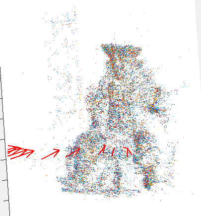
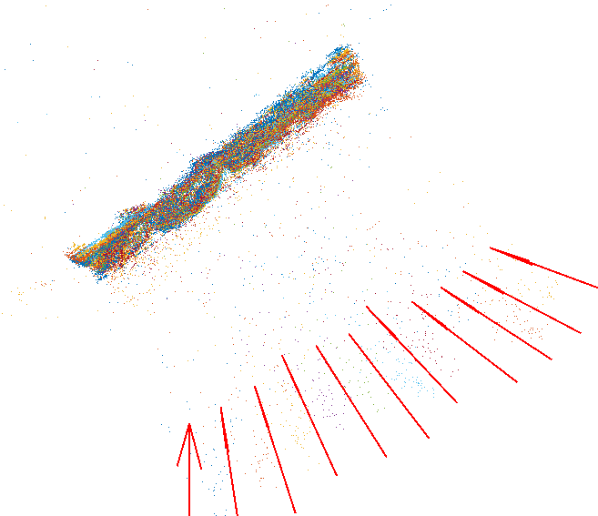

## Assignment 2
+ 2024-1-9
+ Honggang Chen, CID: chenhon 
---

### Algorithm design choices.
+ Step 1, In order to address problems from dominant plane scenes, I implemented the parallel version of RANSAC (8-point method to estimate E and 4-point method to estimate H).
+ Step 2, for this step, no special handling is required. Just calculate the absolute rotation using the rotation chain obtained from Step 1.
+ Step 3, in the first part of this step, I reconstructed initial 3D points from initial image pairs using the parallel version of RANSAC. Subsequently, I optimized the initial 3D points with the Levenberg-Marquardt (LM) method, similar to the process in Computer Exercise 3 of Assignment 4. Then, I filtered out the points that are far away from the point cloud center. 
+ step 4, in this step, I implemented a 2-point method for estimating T (translation).
+ step 5, translation vectors were optimized in this step using the LM method
+ step 6, in this step, triangulate DLT method was used for computing X for all pairs.
  
### Result 

|data set id |parallel version RANSAC | standar version RANSAC |
|-|-|-|
|3| |  | 
|4|  |  |

|data set id |parallel version RANSAC | standar version RANSAC |
|-|-|-|
|5| |  | 
|6| |  | 

|data set id |parallel version RANSAC | standar version RANSAC |
|-|-|-|
|7| |  | 
|8| fail to generate a reasonable reuslt|  | 
|9| |  |

### Problems I encountered
+ for dataset 4, using provided pixel_threshold, I failed to estimate T for all cameras, thus I changed it from 1 to 2. And also with rotations from parallel version RANSAC, the 3d points is unexcepted, however, the result from standard version looks more reasonable. (different figures showed in Result table dataset 4.) 

+ for dataset 5, similar problem as dataset 4, parallel RANSAC using default threshold , thus I have to modify the threshold as description in "Changes to provided code" section. 

+ for dataset 6, parallel version yield a worse result (as figure show above, )

+ for dataset 7, standard version does can not handle the plane dominate scense, and the parallel version yield a reasonable result.

### Changes to provided code 
+ for dataset 4, pixel_threshold was changed to 2.0
+ for dataset 5, when using parallel version RANSAC, homography_threshold was changed to 2 * 3 * pixel_threshold, translation_threshold = 3 * 3 * pixel_threshold

